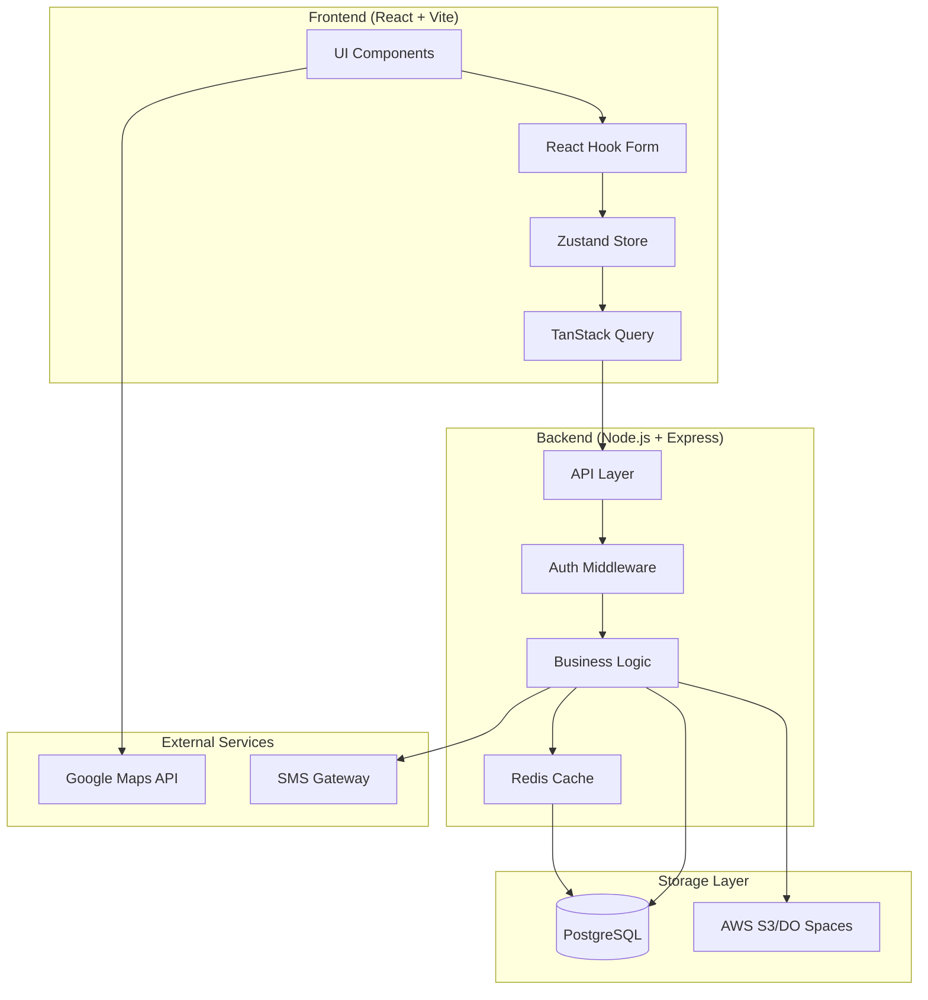

```mermaid
flowchart TD
    subgraph Client["Frontend (React + Vite)"]
        UI[UI Components]
        ZS[Zustand Store]
        TQ[TanStack Query]
        RF[React Hook Form]
    end

    subgraph Server["Backend (Node.js + Express)"]
        API[API Layer]
        Auth[Auth Middleware]
        BL[Business Logic]
        Cache[Redis Cache]
    end

    subgraph Storage["Storage Layer"]
        DB[(PostgreSQL)]
        S3[AWS S3/DO Spaces]
    end

    subgraph External["External Services"]
        Maps[Google Maps API]
        SMS[SMS Gateway]
    end

    UI --> RF
    RF --> ZS
    ZS --> TQ
    TQ --> API
    API --> Auth
    Auth --> BL
    BL --> Cache
    Cache --> DB
    BL --> DB
    BL --> S3
    UI --> Maps
    BL --> SMS
```