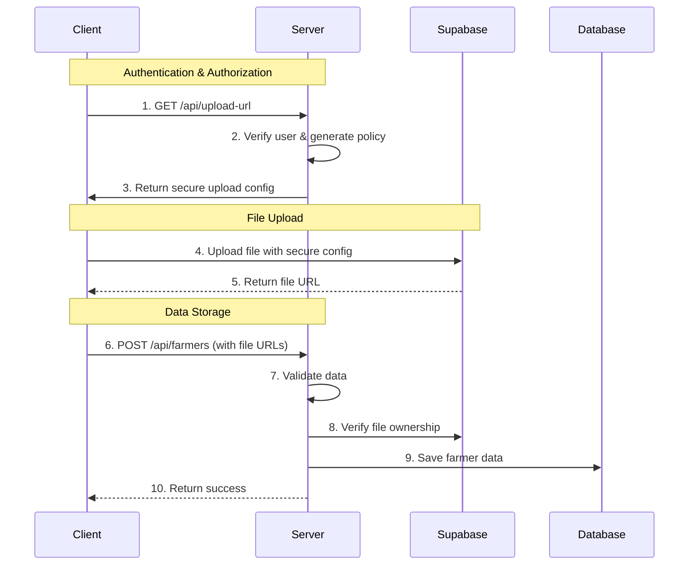
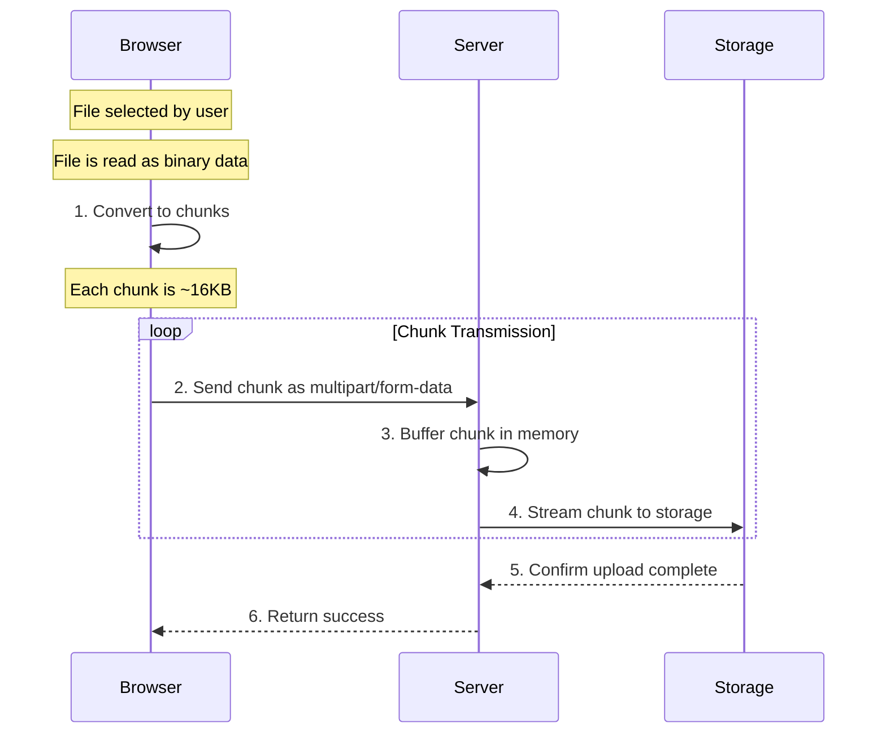
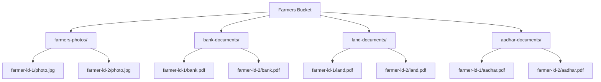

## Client-Server Architecture 

```mermaid
sequenceDiagram
    participant Client
    participant Server
    participant Supabase

    Note over Client,Server: Authentication & Authorization
    Client->>Server: 1. GET /api/upload-url
    Server->>Server: 2. Verify user & generate policy
    Server->>Client: 3. Return secure upload config

    Note over Client,Supabase: File Upload
    Client->>Supabase: 4. Upload file with secure config
    Supabase-->>Client: 5. Return file URL

    Note over Client,Server: Data Storage
    Client->>Server: 6. POST /api/farmers (with file URLs)
    Server->>Server: 7. Validate data
    Server->>Supabase: 8. Verify file ownership
    Server->>Database: 9. Save farmer data
    Server-->>Client: 10. Return success

```
---
## How data is streamed across the internet

```mermaid
sequenceDiagram
    participant Browser
    participant Server
    participant Storage

    Note over Browser: File selected by user
    Note over Browser: File is read as binary data
    
    Browser->>Browser: 1. Convert to chunks
    Note over Browser: Each chunk is ~16KB

    loop Chunk Transmission
        Browser->>Server: 2. Send chunk as multipart/form-data
        Server->>Server: 3. Buffer chunk in memory
        Server->>Storage: 4. Stream chunk to storage
    end

    Storage-->>Server: 5. Confirm upload complete
    Server-->>Browser: 6. Return success
```
---

## S3 bucket structure

```mermaid
graph TD
    A[Farmers Bucket] --> B[farmers-photos/]
    A --> C[bank-documents/]
    A --> D[land-documents/]
    A --> E[aadhar-documents/]

    B --> B1[farmer-id-1/photo.jpg]
    B --> B2[farmer-id-2/photo.jpg]

    C --> C1[farmer-id-1/bank.pdf]
    C --> C2[farmer-id-2/bank.pdf]

    D --> D1[farmer-id-1/land.pdf]
    D --> D2[farmer-id-2/land.pdf]

    E --> E1[farmer-id-1/aadhar.pdf]
    E --> E2[farmer-id-2/aadhar.pdf]
```